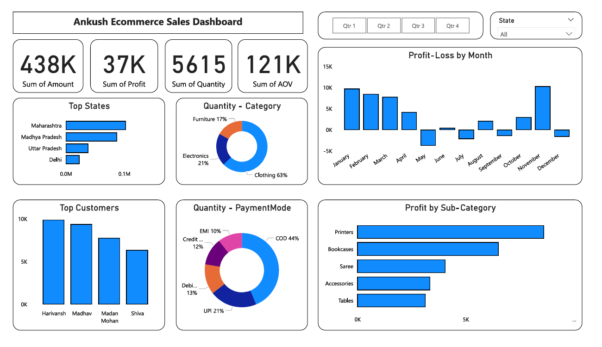

# ecommerce-dashboard
A Power BI dashboard project developed by Ankush to analyze and visualize E-commerce performance. The dashboard provides interactive insights on total sales, profit, customer distribution, regional sales, product categories, and time-based trends. Designed for business users to monitor KPIs and make data-driven decisions effectively.
# 📊 Ankush's E-Commerce Dashboard (Power BI)

A sleek and interactive Power BI dashboard built to analyze E-commerce performance. It showcases key business metrics like sales, profit, orders, customer trends, and top-performing products — all in one view.

---

## 📸 Dashboard Preview

---

## 🚀 Key KPIs (Key Performance Indicators)

- Total Sales & Profit
- Monthly Sales Trend
- Top Products by Sales
- Sales by state & Category
- Customer Count & Orders

---

## 🛠️ Tools Used

- Power BI Desktop
- CSV Dataset
- DAX & Power Query

---

---

## 👤 Created by Ankush Singh

B.Tech Student | BI & Data Enthusiast  
[https://www.linkedin.com/in/ankushsinghpec/]
